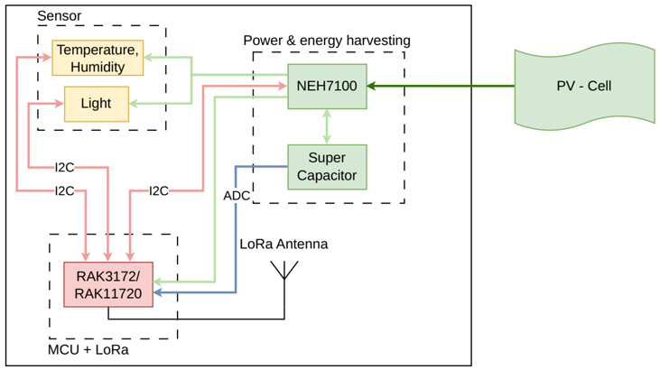

# 🌧️ Rain Gauge LoRaWAN Node (RAK3172 / RAK11720)

This project is an **energy-harvesting LoRaWAN sensor node** for environmental monitoring. It supports ultra-low power operation using a supercapacitor and solar harvesting.

---

# 🔗 Live Dashboard (Grafana)

📊 You can monitor real-time data here:
👉 **[Grafana Dashboard](https://link.uit.edu.vn/GrafanaRaingauge)**

Features:

* Battery voltage (supercapacitor)
* Harvesting current
* Temperature & humidity
* Light intensity (lux)
* Node state (energy mode)

---

# 📂 Project Structure

```id="h4b3f0"
.
├── src/                            # Firmware source code
├── docs/                           # Documentation
│   └── node-red/
│   |   └── flow.json
|   └──grafana/
│       └── dashboard.json
├── Hardware/                       # Open-source hardware (PCB, schematic)
└── RainGauge_LoRaWAN_ABP_Lib.ino   # Main firmware
└── README.md
```

---

# ⚙️ System Overview

## 🧩 System Architecture



> 📌 Replace this image with your actual diagram inside `/docs`

---

## 🔋 Energy Flow

```id="0t9s6o"
Indoor PV Panel → NEH7100 → Supercapacitor → MCU
                  NEH7100 → MCU
```

* NEH7100 handles MPPT and regulation
* Supercapacitor stores energy (max 3.8V)
* MCU adapts behavior based on energy availability

---

# ⚙️ Firmware Features

* Adaptive scheduling (energy-aware)
* LoRaWAN uplink (TTN compatible)
* Multi-sensor support:

  * SHTC3 (Temp/Humidity)
  * LTR303 (Lux)
* Dynamic sleep control

---

# 🚀 Getting Started

## 1. Hardware Setup

* RAK3172 / RAK11720
* NEH7100 PMIC
* Supercapacitor (Low Leakage-current )
* Sensors (SHTC3, LTR303)

---

## 2. Software Setup

* Install Arduino IDE
* Install RAKwireless BSP in Arduino IDE
* Select correct board
* Upload firmware

---

## 3. Configuration

Edit `config.h` and `sensor_manager.h`:

```cpp id="i2z2p3"
#define USE_RAK3172 0
#define VBAT_PIN PA15
```

---

## 4. LoRaWAN (TTN)

Supports:

* OTAA 
* ABP (Used)

---

# 📦 Payload Format

| Byte | Data                       |
| ---- | ---------------------------|
| 0-1  | Temperature                |
| 2    | Humidity                   |
| 3-4  | Voltage supercapacitor     |
| 5-6  | Current                    |
| 7    | State                      |
| 8-9  | Lux                        |
---

# 🧠 Energy-Aware Scheduler

This table defines system behavior based on battery voltage (VBAT) and current conditions.

| State | Status Name     | VBAT Condition | Current Condition | LoRa Tx | Sleep (s) | Sleep (min) | Description                          |
|------:|----------------|----------------|-------------------|---------|-----------|--------------|--------------------------------------|
| 30    | 🔴 CRITICAL     | < 2.8V         | Any               | ❌ No   | 3600      | 60           | Near shutdown → maximum power saving |
| 20    | 🟡 LOW - Night  | 2.8–3.0V       | < 40 µA           | ✅ Yes  | 1800      | 30           | Low battery + no energy harvesting   |
| 21    | 🟡 LOW - Day    | 2.8–3.0V       | ≥ 40 µA           | ✅ Yes  | 1200      | 20           | Low battery but charging             |
| 10    | 🟢 NORMAL - Night | 3.0–3.3V    | < 40 µA           | ✅ Yes  | 1200      | 20           | Stable but no energy harvesting      |
| 11    | 🟢 NORMAL - Day | 3.0–3.3V       | ≥ 40 µA           | ✅ Yes  | 900       | 15           | Stable + charging                    |
| 0     | 🔵 HIGH         | ≥ 3.3V         | Any               | ✅ Yes  | 600       | 10           | Energy surplus                       |

## Notes

- **VBAT**: Battery voltage level.
- **Current Condition** is used to determine whether energy harvesting (e.g., solar) is active.
- **LoRa Tx**: Indicates whether LoRa transmission is enabled.
- Sleep duration dynamically adjusts to conserve power.

# 🛠️ Hardware (Open Source)

📁 Located in `/Hardware`

## Included Files:

* 📐 Schematic (PDF)
* 🧱 PCB Layout (Altium/KiCad)
* 📋 BOM (Bill of Materials)

## Design Highlights:

* NEH7100 energy harvesting PMIC
* Supercapacitor storage
* Low-leakage voltage divider
* Optional LTR303 light sensor

---

# 📊 Hardware Notes

## VBAT Measurement

```id="1h4e3g"
VBAT → Divider → ADC (PA15 with RAK3172 and 33 with RAK11720)
```

---

# 📈 Calibration

## Voltage:

```cpp id="d0c1gh"
V = Vref * (ADC / 4095.0) * scale_factor;
```

## Lux:

```cpp id="drh6j3"
lux = 0.07 * CH0 - 0.02 * CH1;
```

---

# Backend Server Setup

This project uses the following data pipeline:

TTN → Node-RED (MQTT) → InfluxDB v2.7.12 → Grafana Dashboard

## 1. Architecture Overview

- **TTN (The Things Network)**: Receives LoRaWAN uplink data from the device.
- **Node-RED**: Subscribes to TTN via MQTT, decodes payload, and forwards data to InfluxDB.
- **InfluxDB v2.7.12**: Stores time-series data.
- **Grafana**: Visualizes data through dashboards.

---

## 2. Prerequisites

- A registered TTN application and end-device
- MQTT API key from TTN
- Node-RED installed
- InfluxDB v2.7.12 installed
- Grafana installed

---

## 3. TTN Configuration

1. Go to your TTN Console.
2. Create an **Application** and **End Device**.
3. Navigate to:
   - **Integrations → MQTT**
4. Get the following credentials:
   - Broker: `eu1.cloud.thethings.network` (or your region)
   - Port: `1883`
   - Username: `app_id`
   - Password: `NNSXS...` (API Key)

---

## 4. Node-RED Setup

### Import Flow

Import the provided Node-RED flow:

bash
node-red/
└── flow_nodered.json

---

## 4. InfluxDB v2.7.12 Setup

### 1. Requirements

Make sure the following services are already installed and running:

- InfluxDB v2.7.12
- Node-RED (configured separately)

---

### 2. Configuration Files

Example structure:

```bash
influxdb/
├── bucket.json
├── org.json
└── sample_data.lp

```

🚀 *Autonomous IoT powered by ambient energy*
